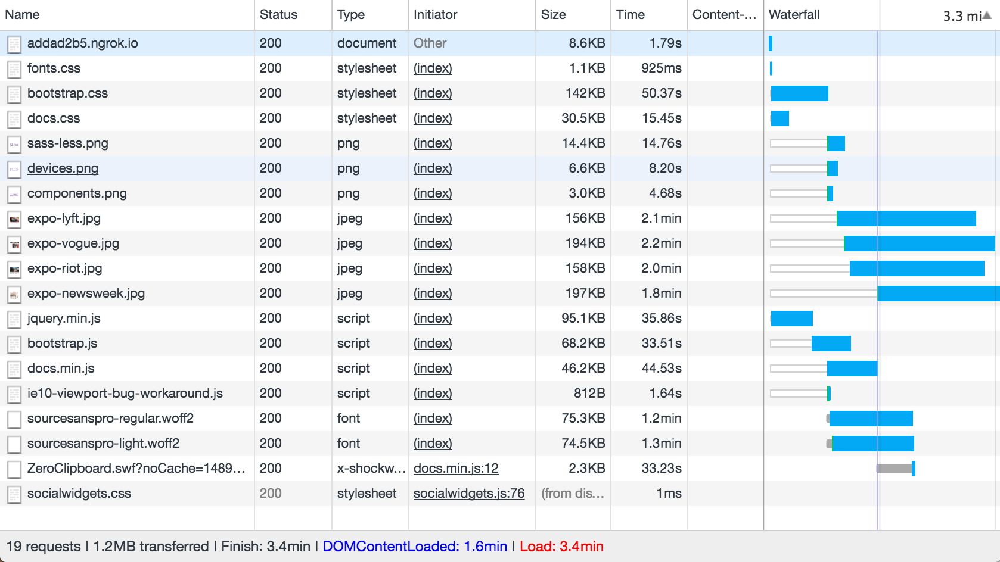
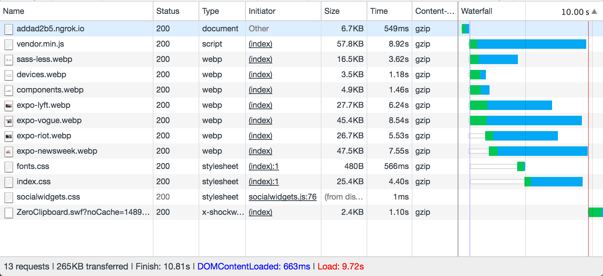

# Performance matters

## Project setup

This project serves an adapted version of the [Bootstrap documentation website](http://getbootstrap.com/). It is based on the [github pages branche of Bootstrap](https://github.com/twbs/bootstrap/tree/gh-pages).

Differences from actual Bootstrap documentation:

- Added custom webfont
- Removed third party scripts
- The src directory is served with [Express](https://expressjs.com/).
- Templating is done with [Nunjucks](https://mozilla.github.io/nunjucks/)

## Getting started

- Install dependencies: `npm install`
- Serve: `npm start`
- Expose localhost: `npm run expose`

# Changes
> **Note**: the results from every feature is based on the original to see the difference. The performance of the features don't stack until the end result. Testing is done via ngrok.

## The original at `50kb/s`
Ouch.. Hope you made some tea during those 3.4 minutes.




> Quite some work to do as you can see here in this screenshot of PageSpeed Insights.

## Image optimization
With a build process to automate the optimization we already see some improvement.

```
const handlers = {}

gulp.task('develop', cb => runSequence('build:images', 'build:webp', cb))
gulp.task('build:images', buildImages)
gulp.task('build:webp', buildWebp)

handlers.onStreamError = function (error) {
	console.error(error.message)
	this.emit('end')
}

function buildImages() {
	gulp.src(['src/**/*.png', 'src/**/*.jpg', 'src/**/*.jpeg'])
		.pipe(imagemin([imagemin.gifsicle(), imagemin.jpegtran(), imagemin.optipng(), imagemin.svgo(), imageminWebp({quality: 70})]))
		.on('error', handlers.onStreamError)
		.pipe(gulp.dest('src'))
}

function buildWebp() {
	gulp.src(['src/**/*.png', 'src/**/*.jpg', 'src/**/*.jpeg'])
		.pipe(webp())
		.pipe(gulp.dest('src'))
}

```


>  9 points improvement

## Server Side Compression (gzip)

```
app.use(compression({
	threshold: 0,
	filter: () => true, // Compress all assets by default
}));
```


> 10 points improvement

## Font Subsetting
Using the micro library `FontFaceObserver` from Bram Stein.

```
const sourceSansProRegular = new FontFaceObserver('source_sans_pro', {
	weight: '400',
	style: 'normal'
})
const sourceSansProItalic = new FontFaceObserver('source_sans_pro', {
	weight: '400',
	style: 'italic'
})
const sourceSansProLight = new FontFaceObserver('source_sans_pro', {
	weight: '300',
	style: 'normal'
})
const sourceSansProLightItalic = new FontFaceObserver('source_sans_pro', {
	weight: '300',
	style: 'italic'
})
Promise.all([
	sourceSansProRegular.load(),
	sourceSansProItalic.load(),
	sourceSansProLight.load(),
	sourceSansProLightItalic.load()
]).then(function () {
	document.documentElement.className += ' fonts-loaded'
	sessionStorage.setItem('fontsLoaded', true)
})
```
No noticable speed changes, though this solves the flash of invisible text problem (FOIT).

## Minification & Concatanation
```
function buildHtml() {
	gulp.src('src/**/*.html')
		.pipe(htmlmin({collapseWhitespace: true}))
		.pipe(gulp.dest('build'))
}

function buildCss() {
	gulp.src(['src/dist/css/bootstrap.css', 'src/assets/css/src/docs.css', 'src/dist/css/bootstrap-theme.css'])
		.pipe(plumber())
		.pipe(sourcemaps.init())
		.on('error', handlers.onStreamError)
		.pipe(minifyCSS())
		.pipe(concat('index.css'))
		.pipe(sourcemaps.write('./'))
		.pipe(gulp.dest('build/dist/css'))
}

function buildVendor() {
	gulp.src([
		'src/assets/js/vendor/jquery.min.js',
		'src/dist/js/bootstrap.js',
		'src/assets/js/docs.min.js',
		'src/assets/js/ie10-viewport-bug-workaround.js'
	]).pipe(plumber())
		.pipe(sourcemaps.init())
		.pipe(concat('vendor.min.js'))
		.pipe(uglify())
		.pipe(sourcemaps.write('./'))
		.on('error', handlers.onStreamError)
		.pipe(gulp.dest('build/assets/vendor'))
}
```

```
<script src="./assets/vendor/vendor.min.js" async></script>
```

Notice the async attribute, which starts parsing the script while simultaneously parsing DOM. I tested async, defer, and without either. Async results in the fasted DOMContentLoaded.


> 5 points improvement

## Asynchronous CSS & Critical CSS
Using the micro library `loadCSS` from Filament Group.
Critical CSS generated using critical path css generator.

```
<style>
// Inline critical css
</style>

<script>
	const fonts = loadCSS('/dist/css/fonts.css');
	const styles = loadCSS('/dist/css/index.css');
</script>
<noscript>
	<link href="/dist/css/fonts.css" rel="stylesheet">
	<link href="/dist/css/index.css" rel="stylesheet">
</noscript>
```


> 10 point improvement

## The end result at `50kb/s`
Would you look at that! That's 265kb of pure performance. Even though it takes rougly 10 seconds before everything is handled, the DOM is already loaded after 663 miliseconds! And thus, the user instantaneously sees something useful.

/Screen Shot 2017-03-16 at 23.26.52.png



